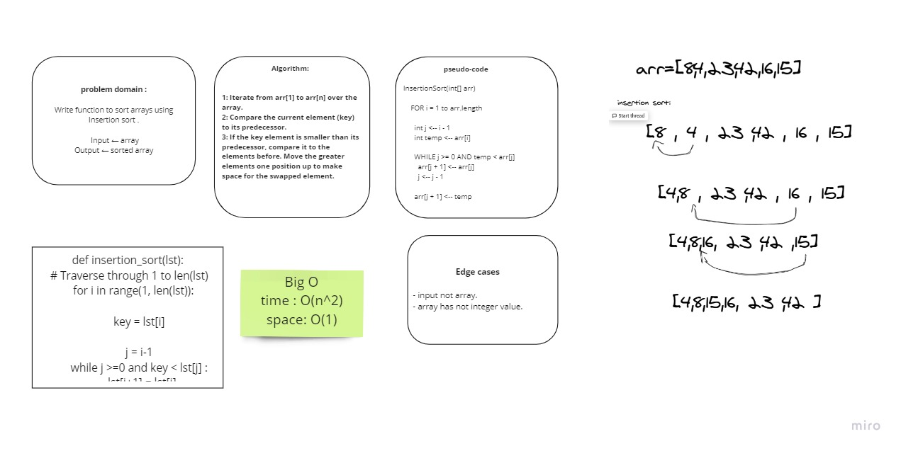

# Challenge Summary
<!-- Description of the challenge -->
 trace the algorithm by stepping through the process with the provided sample array. Document your explanation by creating a blog article that shows the step-by-step output after each iteration through some sort of visual.

## Whiteboard Process
<!-- Embedded whiteboard image -->

## Approach & Efficiency
<!-- What approach did you take? Why? What is the Big O space/time for this approach? -->
Time: O(n^2)
Space: O(1)

## Solution
<!-- Show how to run your code, and examples of it in action -->
 ins_sort([20,18,12,8,5,-2]) ->  [-2, 5, 8, 12, 18, 20]
 ins_sort([5,12,7,5,5,7]) ->     [5, 5, 5, 7, 7, 12]
 ins_sort([2,3,5,7,13,11]) ->    [2, 3, 5, 7, 11, 13]

# Note:

## this whitboard and the Blog is a collaboration with Noor and Raneem
