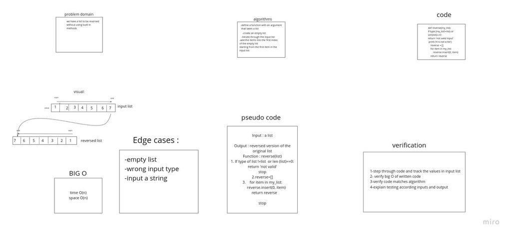

# Reverse an Array
this is a program that takes an array and a value amd search for the value in an array  

## Challenge
take a list and a value and find the value inside the array using binary search return the index of the 
calue in the list or -1 if the value is not found

## Approach & Efficiency
I used O(log n) because it is a liner ur order list so O(log n) will perform better in speed and time 

## Solution
