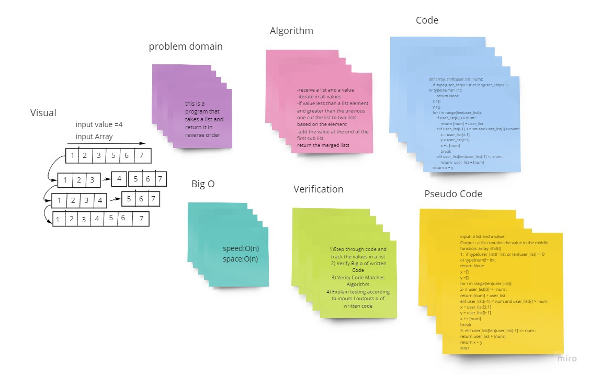

# Shift an Array
this is a program that takes a list and a number and return it a list that contain the number in an order way

## Challenge
take a list and a value and return a list with the value to be added. Without utilizing any of the built-in methods
 

## Approach & Efficiency
it uses O(n) because it is a liner order and we check every two  order list values 

## Solution

