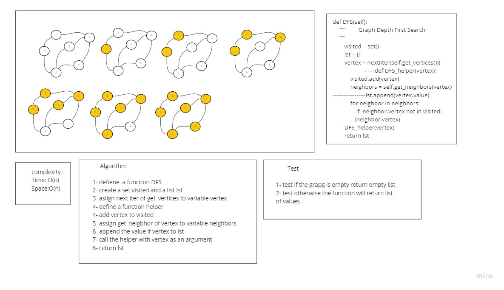

# Graphs
<!-- Short summary or background information -->
A graph is a non-linear data structure that can be looked at as a collection of vertices (or nodes) potentially connected by line segments named edges.
## Challenge
<!-- Description of the challenge -->
Implement your own Graph. The graph should be represented as an adjacency list, and should include the following methods:

### add node
- Arguments: value
= Returns: The added node
- Add a node to the graph
### add edge
- Arguments: 2 nodes to be connected by the edge, weight (optional)
- Returns: nothing
- Adds a new edge between two nodes in the graph
- If specified, assign a weight to the edge
- Both nodes should already be in the Graph
### get nodes
- Arguments: none
- Returns all of the nodes in the graph as a collection (set, list, or similar)
### get neighbors
- Arguments: node
- Returns a collection of edges connected to the given node
- Include the weight of the connection in the returned collection

## Approach & Efficiency
<!-- What approach did you take? Why? What is the Big O space/time for this approach? -->
- add_node():

    - time Big O(1)
    - space Big O(1)

- add_vertex():

    - time Big O(1)
    - space Big O(1)

- add_edge():

    - time Big O(1)
    - space Big O(1)

- get_neighbors():

    - time Big O(1)
    - space Big O(1)

- size():

    - time Big O(1)
    - space Big O(1)

## API
<!-- Description of each method publicly available in your Graph -->
### add node
- Arguments: value
= Returns: The added node
- Add a node to the graph
### add edge
- Arguments: 2 nodes to be connected by the edge, weight (optional)
- Returns: nothing
- Adds a new edge between two nodes in the graph
- If specified, assign a weight to the edge
- Both nodes should already be in the Graph
### get nodes
- Arguments: none
- Returns all of the nodes in the graph as a collection (set, list, or similar)
### get neighbors
- Arguments: node
- Returns a collection of edges connected to the given node
- Include the weight of the connection in the returned collection

