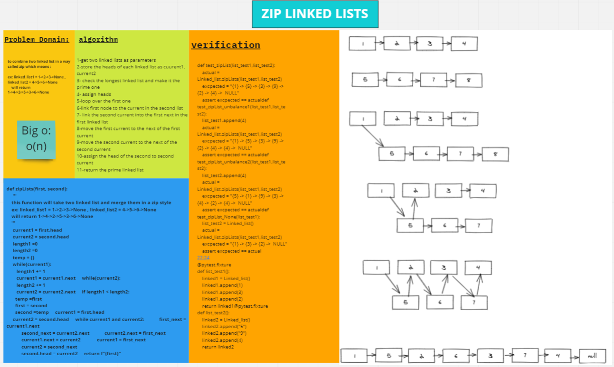

## Solution

# Singly Linked List
linked list is a group of nodes hat points to each others
## Challenge
- a Node class that has properties for the value stored in the Node, and a pointer to the next Node.
Within the LinkedList class, a head property included. Upon instantiation, an empty Linked List should be created.
Define a method called insert which takes any value as an argument and adds a new node with that value to the head of the list with an O(1) Time performance.
- a method called includes which takes any value as an argument and returns a boolean result depending on whether that value exists as a Node’s value somewhere within the list.
- a method called toString (or __str__ in Python) which takes in no arguments and returns a string representing all the values in the Linked List, formatted as:
"{ a } -> { b } -> { c } -> NULL"

## Approach & Efficiency
speed O(n)
memory O(n) 

## API
insert : perpend a new node to the beginning of the linked list
includes: search for a value inside the linked list

## zip_list Solution:

