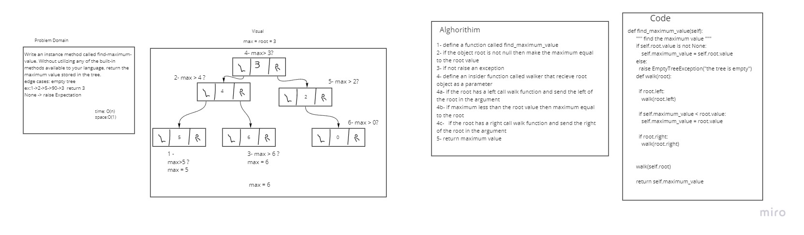

# Challenge Summary
<!-- Description of the challenge -->
Write an instance method called find-maximum-value. Without utilizing any of the built-in methods available to your language, return the maximum value stored in the tree.

## Whiteboard Process
<!-- Embedded whiteboard image -->

## Approach & Efficiency
<!-- What approach did you take? Why? What is the Big O space/time for this approach? -->
speed: bigO(n)
memory: bigO(1)

## Solution
<!-- Show how to run your code, and examples of it in action -->
edge cases: empty tree

ex:1->2->5->90->3  return 3

None -> raise Expectation
