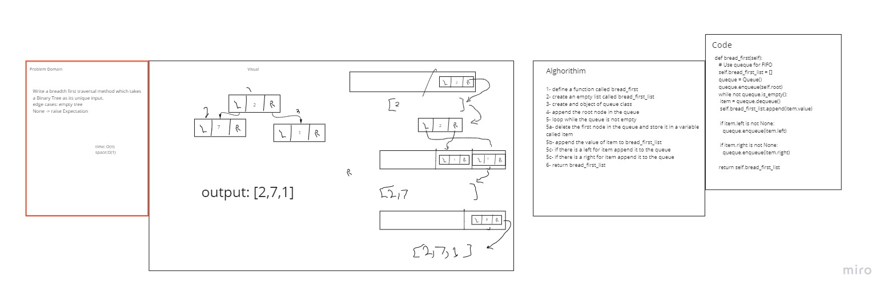

# Challenge Summary
<!-- Description of the challenge -->
Write a breadth first traversal method which takes a Binary Tree as its unique input.
## Whiteboard Process
<!-- Embedded whiteboard image -->

## Approach & Efficiency
<!-- What approach did you take? Why? What is the Big O space/time for this approach? -->
speed:bigO(n)
memory:bigO(n)
## Solution
<!-- Show how to run your code, and examples of it in action -->
  node1.left = TNode(7)
  node1.left.right = TNode(6)
  node1.left.right.left = TNode(5)
  node1.left.right.right = TNode(11)
  node1.left.left = TNode(2)
  node1.right = TNode(5)
  node1.right.right = TNode(9)
  node1.right.right.left = TNode(4)
  binary_tree = Binary_tree(node1)

  result = [2, 7, 5, 2, 6, 9, 5, 11, 4]