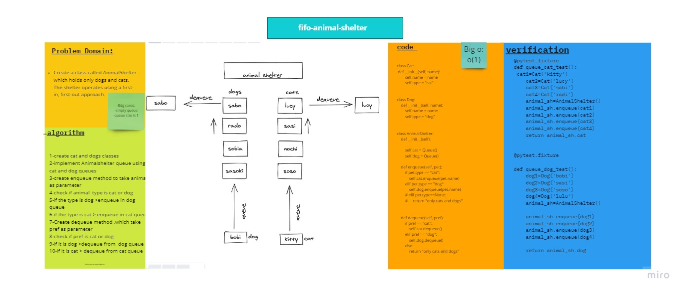

# Challenge Summary
<!-- Description of the challenge -->
Create a class called AnimalShelter which holds only dogs and cats. The shelter operates using a first-in, first-out approach.
Implement the following methods:
enqueue(animal): adds animal to the shelter. animal can be either a dog or a cat object.
dequeue(pref): returns either a dog or a cat. If pref is not "dog" or "cat" then return null.
## Whiteboard Process
<!-- Embedded whiteboard image -->

__this is a collaboration with Noura and Raneem__ 
## Approach & Efficiency
<!-- What approach did you take? Why? What is the Big O space/time for this approach? -->
Big O(1)
## Solution

        class EmptyQueueException(Exception):
            pass
        class Node:
            def __init__(self, value=None):
                self.value = value
                self.next = None
        class Queue:
            def __init__(self):
                self.front = None
                self.rear = None
            def is_empty(self):
                """Returns True if Empty and false otherwise"""
                if self.front:
                    return False
                return True
            def enqueue(self, value):
                """Add an item to the rear fo the queue"""
                node = Node(value)
                if not self.front:
                    # we have an emtpy queue
                    self.front = node
                    self.rear = node
                else:
                    # make sure the previous rear will now point to the new node
                    self.rear.next = node
                    # move our rear to point to the new node
                    self.rear = self.rear.next
            def dequeue(self):
                """delete an item to the rear fo the queue"""
                if not self.is_empty():
                    temp = self.front
                    self.front = self.front.next
                    temp.next = None
                    return temp.value
                raise EmptyQueueException("Cannot dequeue an empty queue")
            def peek(self):
                """Returns the value at the top without modifying the stack, raises an exception otherwise"""
                if not self.is_empty():
                    return self.front.value
                raise EmptyQueueException("Cannot peek an empty queue")
            def __str__(self):
                current = self.front
                items = []
                while current:
                    items.append(str(current.value))
                    current = current.next
                return " ".join(items)
        class Cat:
            def __init__(self, name):
                self.name = name
                self.next = None
                self.type = "cat"
        class Dog:
            def __init__(self, name):
                self.name = name
                self.next = None
                self.type = "dog"
        class AnimalShelter:
            def __init__(self):
                # self.front=None
                # self.rear=None
                self.cat = Queue()
                self.dog = Queue()
            def enqueue(self, pet):
                if pet.type == "cat":
                    self.cat.enqueue(pet.name)
                    # print("it's a cat")
                elif pet.type == "dog":
                    self.dog.enqueue(pet.name)
                    # print("it's a dog")
                else:
                    return "only cats and dogs"
            def dequeue(self, pref):
                if pref == "cat":
                    self.cat.dequeue()
                # print("it's a cat")
                elif pref == "dog":
                    self.dog.dequeue()
                    # print("it's a dog")
                else:
                    return "only cats and dogs"
        if __name__ == "__main__":
            dog1 = Dog("bobi")
            dog2 = Dog("sasi")
            dog3 = Dog("soso")
            dog4 = Dog("lulu")
            cat1 = Cat("kitty")
            cat2 = Cat("Nacho")

            animal_sh = AnimalShelter()
            animal_sh.enqueue(dog2)
            animal_sh.enqueue(cat1)
            animal_sh.enqueue(cat2)
            print(animal_sh.cat)
            print("--------------")
            animal_sh.dequeue("cat")
            print(animal_sh.cat)