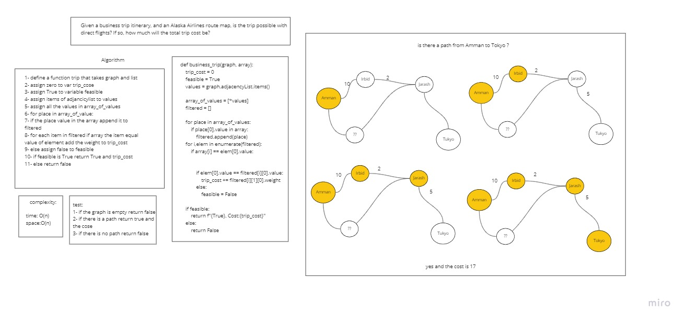

# Challenge Summary
Given a business trip itinerary, and an Alaska Airlines route map, is the trip possible with direct flights? If so, how much will the total trip cost be?
## Whiteboard Process
<!-- Embedded whiteboard image -->

## Approach & Efficiency
<!-- What approach did you take? Why? What is the Big O space/time for this approach? -->
time: O(n)
space:O(n)
## Solution
<!-- Show how to run your code, and examples of it in action -->
1- if the graph is empty return false
2- if there is a path return true and
the cose
3- if there is no path return false
