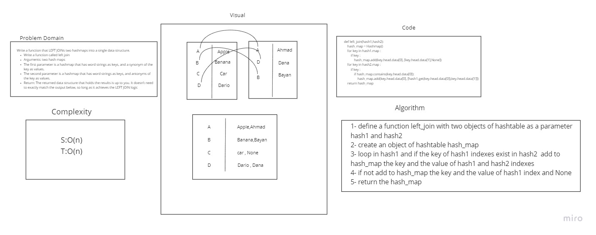

# Hashmap LEFT JOIN
<!-- Short summary or background information -->
 array abstract data type, a structure that can map keys to values. A hash table uses a hash function to compute an index, also called a hash code, into an array of buckets or slots

## Challenge
<!-- Description of the challenge -->
Write a function that LEFT JOINs two hashmaps into a single data structure.

Write a function called left join
Arguments: two hash maps
The first parameter is a hashmap that has word strings as keys, and a synonym of the key as values.
The second parameter is a hashmap that has word strings as keys, and antonyms of the key as values.
Return: The returned data structure that holds the results is up to you. It doesn’t need to exactly match the output below, so long as it achieves the LEFT JOIN logic

## Approach & Efficiency
<!-- What approach did you take? Why? What is the Big O space/time for this approach? -->
S:O(n)
T:O(n)
## WhiteBoard
<!-- Embedded whiteboard image -->

- [x] Top-level README “Table of Contents” is updated
 - [x] README for this challenge is complete
      - [x] Summary, Description, Approach & Efficiency, Solution
      - [x] Picture of whiteboard
      - [x] Link to code
 - [x] Feature tasks for this challenge are completed
 - [x] Unit tests written and passing
      - [x] “Happy Path” - Expected outcome
      - [x] Expected failure
      - [x] Edge Case (if applicable/obvious)

