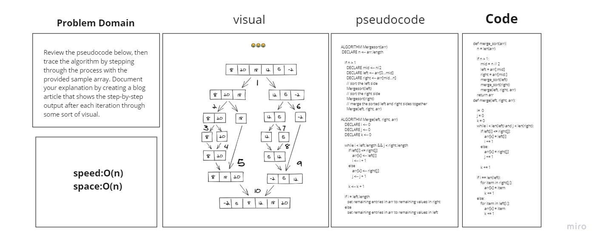

# Challenge Summary
<!-- Description of the challenge -->
Review the pseudocode below, then trace the algorithm by stepping through the process with the provided sample array. Document your explanation by creating a blog article that shows the step-by-step output after each iteration through some sort of visual.

## Whiteboard Process
<!-- Embedded whiteboard image -->

## Approach & Efficiency
<!-- What approach did you take? Why? What is the Big O space/time for this approach? -->
speed(n)
space(1)

## Solution
<!-- Show how to run your code, and examples of it in action -->
[8,20,18,12,5,-2] -> [8,20,18] [12,5,-2] -> [8,20][18][12,5][-2]->[8][20][18]...[12][5][-2]
