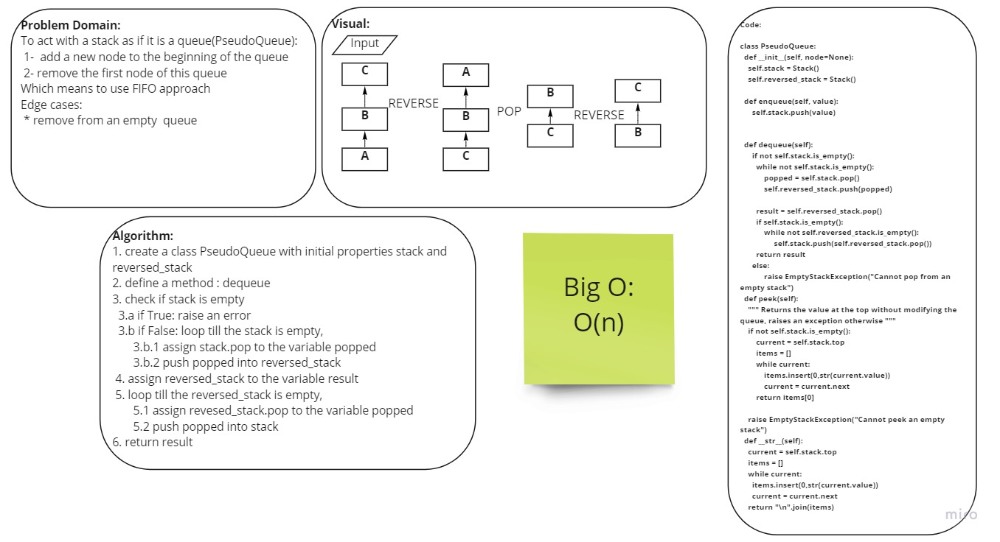

# Challenge Summary
<!-- Description of the challenge -->
Create a brand new PseudoQueue class. Do not use an existing Queue. Instead, this PseudoQueue class will implement our standard queue interface (the two methods listed below), but will internally only utilize 2 Stack objects.
## Whiteboard Process
<!-- Embedded whiteboard image -->
collaboration with Tala

## Approach & Efficiency
<!-- What approach did you take? Why? What is the Big O space/time for this approach? -->
O(n)
## Solution
<!-- Show how to run your code, and examples of it in action -->
input: [4,3,2,1]
dequeue 
output :[4,3,2]
