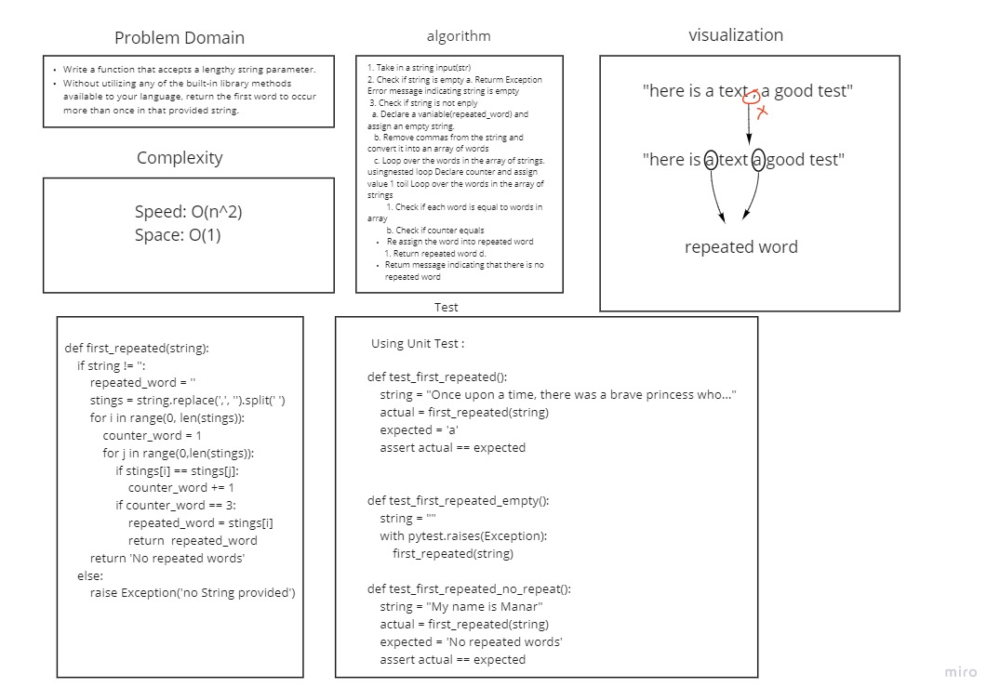

# Challenge Summary
<!-- Description of the challenge -->
Write a function that accepts a lengthy string parameter.
Without utilizing any of the built-in library methods available to your language, return the first word to occur more than once in that provided string.

## Whiteboard Process
<!-- Embedded whiteboard image -->

## Approach & Efficiency
<!-- What approach did you take? Why? What is the Big O space/time for this approach? -->
spead : BigO(n^2)
space: BigO(1)

## Solution
<!-- Show how to run your code, and examples of it in action -->
input : "here is a text , a good test"
output :a
