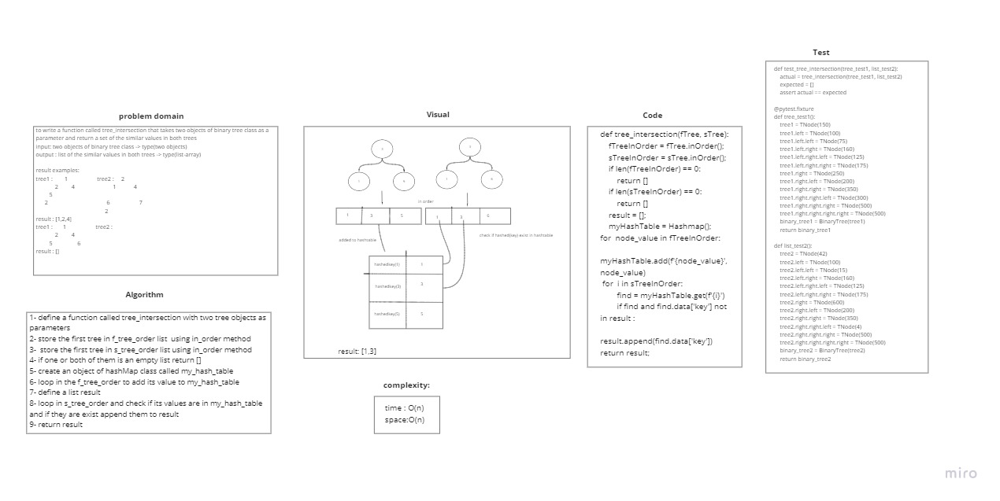

# Challenge Summary
<!-- Description of the challenge -->
Write a function called tree_intersection that takes two binary tree parameters.
Without utilizing any of the built-in library methods available to your language, return a set of values found in both trees.
## Whiteboard Process
<!-- Embedded whiteboard image -->

## Approach & Efficiency
<!-- What approach did you take? Why? What is the Big O space/time for this approach? -->
T: bigO(n)
S: bigO(n)
## Solution
<!-- Show how to run your code, and examples of it in action -->

result examples:
tree1 :        1                    tree2 :     2
             2         4                          1            4
         5
      2                                        6                    7
                                               2

result : [1,2,4]

tree1 :       1                    tree2 :
             2         4
         5                 6

result : []
